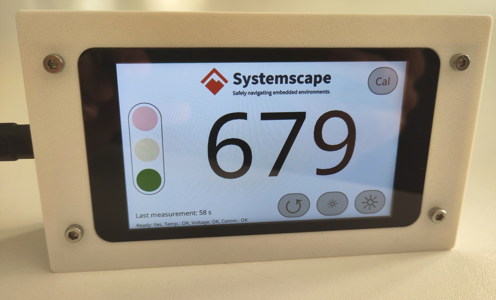

# embedded-dal

First steps exploring the the idea of an embedded Display Abstraction Layer (DAL) for Rust.

This work mainly led to PRs for [embassy](https://github.com/embassy-rs/embassy), adding a DSIHOST and LTDC [driver](https://github.com/embassy-rs/embassy/pull/2903) and [example](https://github.com/embassy-rs/embassy/pull/2976) for embassy-stm32.

## Status
Currently contains a working example of a CO2 monitor using
- an [Infineon PAS CO2](https://crates.io/crates/pas-co2-rs) sensor
- [Slint](https://slint.dev/) as a UI framework
- STM32F469 Discovery Kit



## Running
Connect an Infineon PAS CO2 sensor to PB8 (SCL) and PB9 (SDA) and run
```sh
cargo run --example
```
